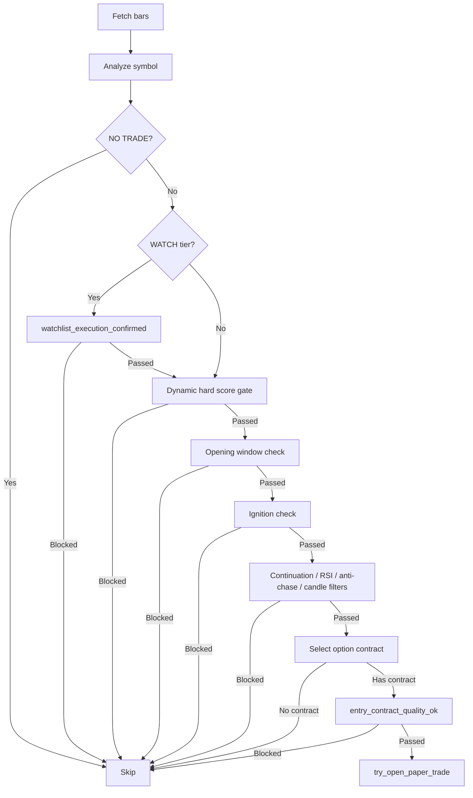
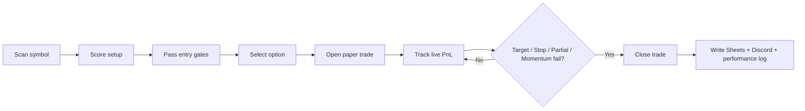

# Strategy Spec

This bot is a technical trend-entry system with layered gates. It scans symbols, scores bull vs bear structure, filters for timing and quality, picks an option contract, opens a paper trade, then manages exits until the position is closed.

## 1. Core Idea

The bot does **not** trade on fundamentals alone. It trades when price action, momentum, regime, and option liquidity line up well enough to justify an entry.

The main signal engine is built around:
- VWAP position and VWAP direction
- EMA20 and EMA50 trend
- RSI
- volume and volume acceleration
- recent high/low breakout or breakdown structure
- momentum quality and regime alignment
- option contract liquidity and delta quality

## 2. Entry Flow

### High-level flow

```python
def run_symbol(client, symbol, prefetched_bars=None):
    bars = fetch_bars(client, symbol)
    side, data = analyze(bars, client, symbol)
    if side == "NO TRADE":
        return

    if data["tier"] == "WATCH":
        ok, reason = watchlist_execution_confirmed(symbol, side, data)
        if not ok:
            return

    min_required_score = dynamic_min_required_score(symbol, side, data)
    if side_score(data, side) < min_required_score:
        return

    if not opening_window_exception_ok(symbol, side, data):
        return

    if not ignition_gate_passes(symbol, side, data):
        return

    if not continuation_gate_passes(symbol, side, data):
        return

    if not rsi_filter_passes(symbol, side, data):
        return

    if not anti_chase_passes(symbol, side, data):
        return

    if not candle_confirmation_passes(symbol, side, data):
        return

    option = get_option_contract(symbol, side, data["price"], data, max_ext_from_vwap)
    if not option:
        return

    ok, reason = entry_contract_quality_ok(symbol, side, data, option, max_ext_from_vwap)
    if not ok:
        return

    try_open_paper_trade(symbol, side, option, data)
```

### Signal generation

```python
def analyze(df, client, symbol):
    # Build indicators
    # Score bull and bear sides
    # Return the dominant side or NO TRADE
```

The scoring model uses:
- price vs VWAP
- price vs EMA20
- price vs EMA50
- EMA20 slope
- RSI
- recent high/low break structure
- volume and candle direction
- relative regime and momentum quality

### Gate order

1. Signal side must be valid.
2. WATCH tier setups must pass selective promotion.
3. Dynamic hard score floor must be cleared.
4. Opening window rules must allow the setup.
5. Ignition must confirm the move is starting.
6. Continuation must not look stale or faded.
7. RSI must not show exhaustion.
8. Anti-chase rules must not reject stretched entries.
9. Candle confirmation must agree with the side.
10. A valid option contract must be selected.
11. The contract must pass liquidity and quality checks.
12. Buying power must support the trade.

## 3. Strategy Shape

The strategy is mostly:
- trend-following
- pullback/reclaim aware
- breakout/breakdown aware
- momentum-confirmation based

It tries to avoid:
- late chasing
- weak continuation
- low-liquidity contracts
- stale signals that already moved too far

For ETFs and stocks, the bot has been simplified so strong directional moves are not blocked by too many redundant checks.

## 4. Code-Level Gate Functions

### Scoring and timing

```python
def analyze(df, client, symbol):
    # Computes bull/bear scores and timing context
    # Returns (side, data)
```

```python
def _classify_entry_timing(data, side):
    # Classifies the setup as:
    # EARLY_BREAKOUT, FIRST_PULLBACK, VWAP_RECLAIM,
    # BREAKDOWN, BREAKDOWN_RETEST, VWAP_REJECT,
    # MOMENTUM_CONTINUATION, LATE_CHASE, MEAN_REVERSION_RISK
```

### Hard score and watchlist logic

```python
def dynamic_min_required_score(symbol, side, data):
    # Returns the minimum score needed to proceed
```

```python
def watchlist_execution_confirmed(symbol, side, data):
    # Promotes WATCH setups only if the move is strong enough
```

### Contract and quality checks

```python
def get_option_contract(symbol, signal, underlying_price, data=None, max_ext_from_vwap=None):
    # Picks the best option candidate
```

```python
def entry_contract_quality_ok(symbol, side, data, option, max_ext_from_vwap):
    # Final contract-quality checklist
```

## 5. Entry State Machine



## 6. Exit Flow

Once a trade is open, the exit monitor runs every cycle.

```python
def track_open_trades():
    for trade in open_trades:
        current_price = get_current_option_price(trade)
        pnl_pct = compute_pnl(trade, current_price)

        if pnl_pct >= target_pct:
            close_trade(trade, current_price, "TARGET HIT", pnl_pct)
        elif pnl_pct <= -stop_pct:
            close_trade(trade, current_price, "STOP LOSS", pnl_pct)
        elif partial_take_profit_reached:
            close_trade(trade, current_price, "PARTIAL TAKE PROFIT", pnl_pct, final_close=False)
        elif momentum_failed(trade):
            close_trade(trade, current_price, "MOMENTUM FAILURE", pnl_pct)
        elif trailing_stop_hit:
            close_trade(trade, current_price, "TRAILING STOP", pnl_pct)
```

### Exit rules

- Profit target closes the full trade.
- Stop loss closes the full trade.
- Partial profit can take off part of the position.
- Momentum failure closes trades when the underlying no longer supports the side.
- Trailing stop protects gains after partial profit.

### Final close bookkeeping

```python
def close_trade(trade, exit_price, reason, pnl_pct, close_qty=None, final_close=True):
    # Submit exit
    # Record Sheets / Discord
    # Preserve partial PnL if the trade had earlier partial exits
```

Final closes now write the **combined** PnL when partial exits occurred, instead of only the last leg.

## 7. Trade Lifecycle



## 8. Practical Takeaway

The bot is best understood as:
- a technical scanner,
- a confirmation engine,
- an option contract selector,
- and a rules-based exit manager.

If it feels too strict, the usual reason is that several gates are stacking together. The simplified ETF and stock entry paths were added to reduce that overblocking.

## 9. Key Functions To Read In Code

### analyze

```python
def analyze(df, client, symbol):
    if len(df) < 55:
        return "NO TRADE", None

    pdh, pdl = get_previous_day_levels(client, symbol)
    df = calculate_indicators(df)

    # Scores bull and bear sides, then selects the dominant side.
```

### dynamic_min_required_score

```python
def dynamic_min_required_score(symbol, side, data):
    base = SCORE_STRONG + 1 if symbol in ETF_SYMBOLS else SCORE_STRONG + max(0, STOCK_STRONG_SCORE_BONUS)
    m = _side_metric_bundle(data, side)
    entry_timing = _classify_entry_timing(data or {}, side)

    relief = 0
    penalty = 0
    if entry_timing in {"FIRST_PULLBACK", "VWAP_RECLAIM", "BREAKDOWN_RETEST", "VWAP_REJECT", "MOMENTUM_CONTINUATION"}:
        relief += 4

    adjusted = int(base - min(DYNAMIC_HARD_GATE_MAX_RELIEF, relief) + min(DYNAMIC_HARD_GATE_MAX_PENALTY, penalty))
    return max(int(floor), adjusted)
```

### watchlist_execution_confirmed

```python
def watchlist_execution_confirmed(symbol, side, data):
    m = _side_metric_bundle(data, side)
    entry_timing = _classify_entry_timing(data or {}, side)

    if symbol in ETF_SYMBOLS and m["delta_5m"] is not None:
        if m["side_score"] >= max(50, SCORE_WATCH - 2):
            return True, "ETF override"

    if STOCK_SIMPLE_ENTRY_MODE and symbol not in ETF_SYMBOLS and m["delta_5m"] is not None:
        if m["side_score"] >= max(48, SCORE_WATCH - 4):
            return True, "stock simplified mode"

    if entry_timing in {"FIRST_PULLBACK", "VWAP_RECLAIM", "BREAKDOWN_RETEST", "VWAP_REJECT", "MOMENTUM_CONTINUATION"}:
        return True, f"pullback/reclaim override ({entry_timing.lower()})"
```

### get_option_contract

```python
def get_option_contract(symbol, signal, underlying_price, data=None, max_ext_from_vwap=None):
    # Fetches candidate contracts from Alpaca, ranks them, and rejects weak liquidity.
    # If the strict path fails, it can fall back to alert-only mode.
```

### entry_contract_quality_ok

```python
def entry_contract_quality_ok(symbol, side, data, option, max_ext_from_vwap):
    if not option:
        return False, "missing option contract"

    if STRICT_IGNITION_NO_BYPASS and IGNITION_REQUIRED and not bool((data or {}).get("ignition_confirmed", False)):
        return False, "ignition not freshly confirmed"

    if ENTRY_ALLOWED_SETUPS and entry_timing not in ENTRY_ALLOWED_SETUPS:
        return False, f"setup {entry_timing} not in allowed setups"
```

### try_open_paper_trade

```python
def try_open_paper_trade(symbol, side, option, data):
    if not ENABLE_ALPACA_PAPER_TRADING:
        return False

    sync_open_trades_from_alpaca()
    qty = position_qty_from_score(score, dominance)
    _, fill_price = place_paper_entry(option, qty)
    trade = open_trade_record(symbol, signal_label, option, score, fill_price, qty, data=data)
```

### track_open_trades

```python
def track_open_trades():
    for trade in list(_open_trades.values()):
        current_price = get_current_option_price(trade)
        pnl_pct = (current_price - trade["entry"]) / trade["entry"]

        if pnl_pct >= target_pct:
            close_trade(trade, current_price, "TARGET HIT", pnl_pct)
        elif pnl_pct <= -stop_pct:
            close_trade(trade, current_price, "STOP LOSS", pnl_pct)
        elif partial_condition_met:
            close_trade(trade, current_price, "PARTIAL TAKE PROFIT", pnl_pct, final_close=False)
```

### close_trade

```python
def close_trade(trade, exit_price, reason, pnl_pct, close_qty=None, final_close=True):
    close_qty_int = int(max(1, min(current_qty, int(close_qty or current_qty))))
    if final_close and _prev_partial_qty > 0 and _combined_cost > 0:
        combined_pnl_pct = _combined_dollar / _combined_cost

    update_alert_close_to_sheets(combined_row, trade)
    log_trade_to_sheets(combined_row, trade, final_close=True)
```

### run_symbol and run_websocket_cycle

```python
def run_symbol(client, symbol, prefetched_bars=None):
    bars = prefetched_bars if prefetched_bars is not None else fetch_bars(client, symbol)
    side, data = analyze(bars, client, symbol)
    # Then applies watchlist, hard-score, ignition, RSI, anti-chase, candle, and contract gates.
```

```python
def run_websocket_cycle(client):
    # Enqueue symbols from ticks, periodically full-scan, and call track_open_trades().
    while True:
        symbols_to_run = _order_symbols_by_priority(symbols_to_run)
        prefetched_bars = prefetch_bars_parallel(client, symbols_to_run)
        for symbol in symbols_to_run:
            run_symbol(client, symbol, prefetched_bars=prefetched_bars.get(symbol))
```
